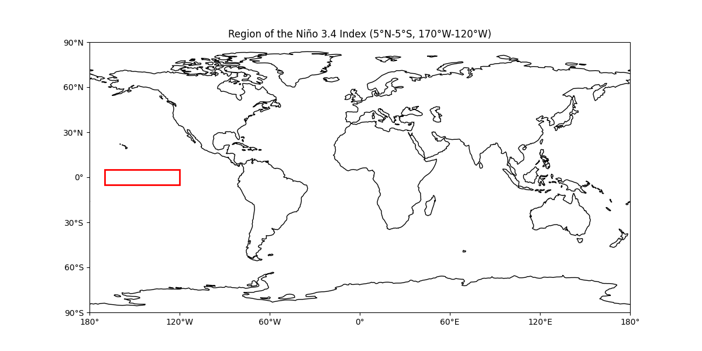

# El-Nino
Machine Learning for Climate and Energy Project with Nathan Toumi

## Main question : 
What is the predictability of El Niño?

## Key Questions:
How accurately can we predict El Niño events based on SST patterns?
What is the prediction horizon ( a few months or a year in advance)?

## Problem Statment: 
Classify sea surface temperature (SST) into one of two categories: El Niño, Neutral Conditions

